# 🎨 GUÍA COMPLETA PARA DESARROLLO FRONTEND EN ANGULAR - NUTRITRACK

> **Documento Técnico para Equipo de Frontend Angular**  
> **Versión:** 3.0 | **Fecha:** 15 de Noviembre, 2025  
> **Backend Repository:** [nutritrack-api](https://github.com/leonelalz/nutritrack-api)  
> **Organización:** 5 Módulos Paralelos con Responsabilidades Claras

---

## 📋 TABLA DE CONTENIDOS

### I. INTRODUCCIÓN Y VISIÓN GENERAL
1. [Visión General del Proyecto](#1-visión-general-del-proyecto)
2. [Arquitectura de la Solución](#2-arquitectura-de-la-solución)
3. [Stack Tecnológico Angular](#3-stack-tecnológico-angular)
4. [Organización del Equipo](#4-organización-del-equipo)

### II. ESTRUCTURA DEL PROYECTO ANGULAR
5. [Estructura de Carpetas](#5-estructura-de-carpetas)
6. [Módulos Angular](#6-módulos-angular)
7. [Configuración Inicial](#7-configuración-inicial)
8. [Dependencias NPM](#8-dependencias-npm)

### III. MÓDULOS POR RESPONSABLE
9. [MÓDULO 1: Autenticación y Perfil](#módulo-1-autenticación-y-perfil-persona-1)
10. [MÓDULO 2: Administración de Contenido](#módulo-2-administración-de-contenido-persona-2)
11. [MÓDULO 3: Gestión de Planes y Rutinas](#módulo-3-gestión-de-planes-y-rutinas-persona-3)
12. [MÓDULO 4: Exploración y Activación](#módulo-4-exploración-y-activación-persona-4)
13. [MÓDULO 5: Seguimiento y Progreso](#módulo-5-seguimiento-y-progreso-persona-5)

### IV. COMPONENTES COMPARTIDOS
14. [Core Module (Compartido)](#14-core-module-compartido)
15. [Shared Module (Compartido)](#15-shared-module-compartido)
16. [Modelos e Interfaces](#16-modelos-e-interfaces)

### V. GUÍAS DE IMPLEMENTACIÓN
17. [Autenticación JWT](#17-autenticación-jwt)
18. [Servicios HTTP](#18-servicios-http)
19. [Manejo de Errores](#19-manejo-de-errores)
20. [Validaciones de Formularios](#20-validaciones-de-formularios)
21. [Reglas de Negocio Críticas](#21-reglas-de-negocio-críticas)

### VI. INTEGRACIÓN Y DESPLIEGUE
22. [Testing](#22-testing)
23. [Checklist de Integración](#23-checklist-de-integración)
24. [Deployment](#24-deployment)

---

## 1. VISIÓN GENERAL DEL PROYECTO

### 1.1 ¿Qué es NutriTrack?

**NutriTrack** es una plataforma web completa de gestión nutricional y fitness que permite:
- 👤 **Usuarios:** Seguir planes personalizados de alimentación y ejercicio
- 👑 **Administradores:** Gestionar catálogos de contenido (ingredientes, comidas, planes, rutinas)

### 1.2 Actores del Sistema

| Actor | Rol | Responsable Frontend |
|-------|-----|---------------------|
| **👤 Usuario Regular (USER)** | Cliente final | Persona 1, 4, 5 |
| **👑 Administrador (ADMIN)** | Gestor de contenido | Persona 2, 3 |

**Capacidades por Actor:**

**Usuario Regular:**
- ✅ Ver catálogo de planes y rutinas (con filtrado por alergias)
- ✅ Activar/pausar/cancelar planes y rutinas
- ✅ Registrar comidas y ejercicios diarios
- ✅ Ver progreso y estadísticas
- ✅ Configurar perfil de salud y alergias

**Administrador:**
- ✅ CRUD completo de: Ingredientes, Ejercicios, Comidas, Etiquetas
- ✅ Crear y gestionar Planes Nutricionales
- ✅ Crear y gestionar Rutinas de Ejercicio
- ❌ **NO puede** acceder a datos personales de usuarios

### 1.3 URLs del Proyecto

| Entorno | URL | Uso |
|---------|-----|-----|
| **Producción** | `https://nutritrack-api-wt8b.onrender.com` | Backend en Render |
| **Swagger UI** | `/swagger-ui.html` | Documentación interactiva |
| **Desarrollo Local** | `http://localhost:8080` | Backend local |
| **Frontend Local** | `http://localhost:4200` | Angular dev server |

---

## 2. ARQUITECTURA DE LA SOLUCIÓN

### 2.1 Diagrama de Capas

```
┌─────────────────────────────────────────────────────┐
│         ANGULAR FRONTEND (Puerto 4200)              │
│  ┌─────────────────────────────────────────────┐   │
│  │  Components (UI)                            │   │
│  ├─────────────────────────────────────────────┤   │
│  │  Services (HTTP)                            │   │
│  ├─────────────────────────────────────────────┤   │
│  │  Guards (Autenticación)                     │   │
│  ├─────────────────────────────────────────────┤   │
│  │  Interceptors (JWT + Errores)               │   │
│  └─────────────────────────────────────────────┘   │
└──────────────────┬──────────────────────────────────┘
                   │ HTTP/REST + JWT
                   ▼
┌─────────────────────────────────────────────────────┐
│      SPRING BOOT BACKEND (Puerto 8080)              │
│  ┌─────────────────────────────────────────────┐   │
│  │  Controllers (REST API)                     │   │
│  ├─────────────────────────────────────────────┤   │
│  │  Services (Lógica de Negocio + RN)          │   │
│  ├─────────────────────────────────────────────┤   │
│  │  Repositories (JPA)                         │   │
│  └─────────────────────────────────────────────┘   │
└──────────────────┬──────────────────────────────────┘
                   │ JDBC
                   ▼
┌─────────────────────────────────────────────────────┐
│         POSTGRESQL DATABASE (Render)                │
│              20+ Tablas Relacionales                │
└─────────────────────────────────────────────────────┘
```

### 2.2 Flujo de Autenticación

```mermaid
sequenceDiagram
    participant U as Usuario
    participant F as Frontend Angular
    participant B as Backend API
    participant DB as PostgreSQL

    U->>F: 1. Ingresa email/password
    F->>B: 2. POST /api/v1/auth/login
    B->>DB: 3. Validar credenciales
    DB-->>B: 4. Usuario válido
    B-->>F: 5. JWT Token + UserInfo
    F->>F: 6. Guardar token en localStorage
    F->>B: 7. GET /api/v1/perfil (Authorization: Bearer)
    B-->>F: 8. Datos del perfil
    F->>U: 9. Redirigir a Dashboard
```



---

## 3. STACK TECNOLÓGICO ANGULAR

### 3.1 Versiones Recomendadas

| Tecnología | Versión | Propósito |
|------------|---------|-----------|
| **Angular** | 17.x o 18.x | Framework principal |
| **TypeScript** | 5.x | Lenguaje |
| **RxJS** | 7.x | Programación reactiva |
| **Angular Material** | 17.x | UI Components |
| **Chart.js** / **ng2-charts** | Latest | Gráficos de progreso |
| **ngx-toastr** | Latest | Notificaciones toast |
| **SweetAlert2** | Latest | Modales elegantes |
| **date-fns** | Latest | Manejo de fechas |

### 3.2 Librerías Adicionales Recomendadas

```json
{
  "dependencies": {
    "@angular/animations": "^17.0.0",
    "@angular/material": "^17.0.0",
    "@angular/cdk": "^17.0.0",
    "chart.js": "^4.4.0",
    "ng2-charts": "^5.0.0",
    "ngx-toastr": "^18.0.0",
    "sweetalert2": "^11.10.0",
    "date-fns": "^3.0.0"
  }
}
```

---

## 4. ORGANIZACIÓN DEL EQUIPO

### 4.1 Distribución de Módulos

| Persona | Módulo Asignado | Componentes Estimados | US Implementadas | Tiempo Estimado |
|---------|----------------|----------------------|------------------|-----------------|
| **Persona 1** | Autenticación y Perfil | 6 componentes | US-01 a US-05 | 2 semanas |
| **Persona 2** | Administración Contenido | 8 componentes | US-06 a US-10 | 3 semanas |
| **Persona 3** | Gestión Planes/Rutinas | 7 componentes | US-11 a US-15 | 3 semanas |
| **Persona 4** | Exploración y Activación | 6 componentes | US-16 a US-20 | 2 semanas |
| **Persona 5** | Seguimiento y Progreso | 7 componentes | US-21 a US-25 | 2 semanas |

**Total:** 34 componentes | 25 User Stories | 12 semanas (trabajo paralelo: 3 semanas)

### 4.2 Dependencias Entre Módulos

```
FASE 1 (Semana 1-2):
- Persona 1: Módulo 1 (Autenticación) ← TODOS dependen de esto
- Core/Shared: Configuración inicial compartida

FASE 2 (Semana 2-3): Paralelo
- Persona 2: Módulo 2 (Admin Contenido)
- Persona 3: Módulo 3 (Admin Planes)
- Persona 4: Módulo 4 (Usuario Exploración)
- Persona 5: Módulo 5 (Usuario Progreso)

FASE 3 (Semana 3-4):
- Integración completa
- Testing end-to-end
- Ajustes de UX
```

### 4.3 Comunicación del Equipo

**Sincronización Diaria (15 min):**
- ¿Qué hice ayer?
- ¿Qué haré hoy?
- ¿Tengo bloqueos?

**Reunión Semanal (1 hora):**
- Demo de avances
- Resolución de conflictos en modelos compartidos
- Planificación de la siguiente semana

**Canales de Comunicación:**
- **Slack/Discord:** Dudas técnicas rápidas
- **GitHub Issues:** Bugs y features
- **GitHub PRs:** Code review entre pares

---

## 5. ESTRUCTURA DE CARPETAS

### 5.1 Estructura Completa del Proyecto

```
nutritrack-frontend/
├── src/
│   ├── app/
│   │   ├── core/                          # Servicios singleton (COMPARTIDO)
│   │   │   ├── guards/
│   │   │   │   ├── auth.guard.ts
│   │   │   │   └── admin.guard.ts
│   │   │   ├── interceptors/
│   │   │   │   ├── jwt.interceptor.ts
│   │   │   │   ├── error.interceptor.ts
│   │   │   │   └── loading.interceptor.ts
│   │   │   ├── services/
│   │   │   │   ├── auth.service.ts
│   │   │   │   ├── storage.service.ts
│   │   │   │   └── notification.service.ts
│   │   │   └── core.module.ts
│   │   │
│   │   ├── shared/                        # Componentes reutilizables (COMPARTIDO)
│   │   │   ├── components/
│   │   │   │   ├── header/
│   │   │   │   ├── sidebar/
│   │   │   │   ├── loading-spinner/
│   │   │   │   ├── confirmation-dialog/
│   │   │   │   └── empty-state/
│   │   │   ├── pipes/
│   │   │   │   ├── unit-converter.pipe.ts
│   │   │   │   └── safe-html.pipe.ts
│   │   │   ├── directives/
│   │   │   │   └── number-only.directive.ts
│   │   │   ├── models/               # Interfaces TypeScript de TODOS los DTOs
│   │   │   │   ├── auth.model.ts
│   │   │   │   ├── perfil.model.ts
│   │   │   │   ├── plan.model.ts
│   │   │   │   ├── rutina.model.ts
│   │   │   │   ├── comida.model.ts
│   │   │   │   ├── ingrediente.model.ts
│   │   │   │   ├── ejercicio.model.ts
│   │   │   │   ├── etiqueta.model.ts
│   │   │   │   ├── registro.model.ts
│   │   │   │   └── api-response.model.ts
│   │   │   └── shared.module.ts
│   │   │
│   │   ├── modules/
│   │   │   ├── auth/                      # MÓDULO 1 (Persona 1)
│   │   │   │   ├── components/
│   │   │   │   │   ├── login/
│   │   │   │   │   ├── registro/
│   │   │   │   │   └── eliminar-cuenta/
│   │   │   │   ├── services/
│   │   │   │   │   └── perfil.service.ts
│   │   │   │   ├── auth-routing.module.ts
│   │   │   │   └── auth.module.ts
│   │   │   │
│   │   │   ├── perfil/                    # MÓDULO 1 (Persona 1)
│   │   │   │   ├── components/
│   │   │   │   │   ├── perfil-salud/
│   │   │   │   │   ├── configurar-unidades/
│   │   │   │   │   └── editar-perfil/
│   │   │   │   ├── perfil-routing.module.ts
│   │   │   │   └── perfil.module.ts
│   │   │   │
│   │   │   ├── admin/                     # MÓDULO 2 y 3 (Persona 2 y 3)
│   │   │   │   ├── etiquetas/             # Persona 2
│   │   │   │   │   ├── lista-etiquetas/
│   │   │   │   │   ├── crear-etiqueta/
│   │   │   │   │   └── editar-etiqueta/
│   │   │   │   ├── ingredientes/          # Persona 2
│   │   │   │   │   ├── lista-ingredientes/
│   │   │   │   │   ├── crear-ingrediente/
│   │   │   │   │   └── editar-ingrediente/
│   │   │   │   ├── ejercicios/            # Persona 2
│   │   │   │   │   └── ...
│   │   │   │   ├── comidas/               # Persona 2
│   │   │   │   │   ├── lista-comidas/
│   │   │   │   │   ├── crear-comida/
│   │   │   │   │   └── gestionar-receta/
│   │   │   │   ├── planes/                # Persona 3
│   │   │   │   │   ├── lista-planes/
│   │   │   │   │   ├── crear-plan/
│   │   │   │   │   ├── configurar-dias-plan/
│   │   │   │   │   └── editar-plan/
│   │   │   │   ├── rutinas/               # Persona 3
│   │   │   │   │   ├── lista-rutinas/
│   │   │   │   │   ├── crear-rutina/
│   │   │   │   │   └── gestionar-ejercicios-rutina/
│   │   │   │   ├── services/
│   │   │   │   │   ├── etiqueta.service.ts     # Persona 2
│   │   │   │   │   ├── ingrediente.service.ts  # Persona 2
│   │   │   │   │   ├── ejercicio.service.ts    # Persona 2
│   │   │   │   │   ├── comida.service.ts       # Persona 2
│   │   │   │   │   ├── plan.service.ts         # Persona 3
│   │   │   │   │   └── rutina.service.ts       # Persona 3
│   │   │   │   ├── admin-routing.module.ts
│   │   │   │   └── admin.module.ts
│   │   │   │
│   │   │   ├── catalogo/                  # MÓDULO 4 (Persona 4)
│   │   │   │   ├── components/
│   │   │   │   │   ├── lista-planes/
│   │   │   │   │   ├── detalle-plan/
│   │   │   │   │   ├── activar-plan/
│   │   │   │   │   ├── lista-rutinas/
│   │   │   │   │   ├── detalle-rutina/
│   │   │   │   │   └── mis-asignaciones/
│   │   │   │   ├── services/
│   │   │   │   │   ├── catalogo-plan.service.ts
│   │   │   │   │   └── usuario-asignacion.service.ts
│   │   │   │   ├── catalogo-routing.module.ts
│   │   │   │   └── catalogo.module.ts
│   │   │   │
│   │   │   ├── seguimiento/               # MÓDULO 5 (Persona 5)
│   │   │   │   ├── components/
│   │   │   │   │   ├── actividades-hoy/
│   │   │   │   │   ├── registrar-comida/
│   │   │   │   │   ├── registrar-ejercicio/
│   │   │   │   │   ├── historial-registros/
│   │   │   │   │   ├── mediciones/
│   │   │   │   │   ├── grafico-progreso/
│   │   │   │   │   └── dashboard/
│   │   │   │   ├── services/
│   │   │   │   │   ├── registro.service.ts
│   │   │   │   │   └── progreso.service.ts
│   │   │   │   ├── seguimiento-routing.module.ts
│   │   │   │   └── seguimiento.module.ts
│   │   │   │
│   │   │   └── layout/
│   │   │       ├── usuario-layout/
│   │   │       └── admin-layout/
│   │   │
│   │   ├── app-routing.module.ts
│   │   ├── app.component.ts
│   │   └── app.module.ts
│   │
│   ├── assets/
│   │   ├── images/
│   │   └── i18n/
│   │
│   ├── environments/
│   │   ├── environment.ts
│   │   └── environment.prod.ts
│   │
│   ├── styles.scss
│   └── index.html
│
├── angular.json
├── package.json
├── tsconfig.json
└── README.md
```

---

## 6. MÓDULOS ANGULAR

### 6.1 Core Module (Singleton)

**Responsabilidad:** Servicios que se instancian UNA SOLA VEZ en toda la aplicación.

**Componentes:**
- `AuthService` - Manejo de autenticación
- `StorageService` - localStorage/sessionStorage
- `NotificationService` - Toasts y alertas
- `AuthGuard` - Protección de rutas
- `AdminGuard` - Protección rutas admin
- `JwtInterceptor` - Agregar token a requests
- `ErrorInterceptor` - Manejo centralizado de errores

### 6.2 Shared Module

**Responsabilidad:** Componentes, pipes y directivas reutilizables.

**Componentes:**
- `HeaderComponent` - Barra de navegación
- `SidebarComponent` - Menú lateral
- `LoadingSpinnerComponent` - Spinner de carga
- `ConfirmationDialogComponent` - Diálogos de confirmación
- `EmptyStateComponent` - Estados vacíos

**Pipes:**
- `UnitConverterPipe` - Convertir KG ↔ LBS
- `SafeHtmlPipe` - Sanitizar HTML

---

## 7. CONFIGURACIÓN INICIAL

### 7.1 Crear Proyecto Angular

```bash
# Instalar Angular CLI
npm install -g @angular/cli

# Crear proyecto
ng new nutritrack-frontend
? Would you like to add Angular routing? Yes
? Which stylesheet format would you like to use? SCSS

cd nutritrack-frontend

# Instalar dependencias
npm install @angular/material @angular/cdk @angular/animations
npm install chart.js ng2-charts
npm install ngx-toastr
npm install sweetalert2
npm install date-fns
```

### 7.2 Configurar Environments

**`src/environments/environment.ts` (Desarrollo):**
```typescript
export const environment = {
  production: false,
  apiUrl: 'http://localhost:8080/api/v1',
  apiTimeout: 30000
};
```

**`src/environments/environment.prod.ts` (Producción):**
```typescript
export const environment = {
  production: true,
  apiUrl: 'https://nutritrack-api-wt8b.onrender.com/api/v1',
  apiTimeout: 30000
};
```

### 7.3 Configurar Angular Material

**`src/app/app.config.ts`:**
```typescript
import { provideAnimations } from '@angular/platform-browser/animations';
import { provideToastr } from 'ngx-toastr';

export const appConfig: ApplicationConfig = {
  providers: [
    provideRouter(routes),
    provideHttpClient(withInterceptors([jwtInterceptor, errorInterceptor])),
    provideAnimations(),
    provideToastr({
      timeOut: 3000,
      positionClass: 'toast-top-right',
      preventDuplicates: true
    })
  ]
};
```

---

## 8. DEPENDENCIAS NPM

### 8.1 Package.json Completo

```json
{
  "name": "nutritrack-frontend",
  "version": "1.0.0",
  "scripts": {
    "ng": "ng",
    "start": "ng serve",
    "build": "ng build",
    "build:prod": "ng build --configuration production",
    "test": "ng test",
    "lint": "ng lint"
  },
  "dependencies": {
    "@angular/animations": "^17.0.0",
    "@angular/common": "^17.0.0",
    "@angular/compiler": "^17.0.0",
    "@angular/core": "^17.0.0",
    "@angular/forms": "^17.0.0",
    "@angular/material": "^17.0.0",
    "@angular/platform-browser": "^17.0.0",
    "@angular/platform-browser-dynamic": "^17.0.0",
    "@angular/router": "^17.0.0",
    "rxjs": "^7.8.0",
    "chart.js": "^4.4.0",
    "ng2-charts": "^5.0.0",
    "ngx-toastr": "^18.0.0",
    "sweetalert2": "^11.10.0",
    "date-fns": "^3.0.0",
    "tslib": "^2.6.0",
    "zone.js": "^0.14.0"
  },
  "devDependencies": {
    "@angular-devkit/build-angular": "^17.0.0",
    "@angular/cli": "^17.0.0",
    "@angular/compiler-cli": "^17.0.0",
    "@types/jasmine": "~5.1.0",
    "jasmine-core": "~5.1.0",
    "karma": "~6.4.0",
    "karma-chrome-launcher": "~3.2.0",
    "karma-coverage": "~2.2.0",
    "karma-jasmine": "~5.1.0",
    "karma-jasmine-html-reporter": "~2.1.0",
    "typescript": "~5.2.0"
  }
}
```

---

## 🏗️ ARQUITECTURA DEL BACKEND

### Estructura de Capas

```
┌─────────────────────────────────────┐
│      Controllers (REST API)         │ ← Frontend se comunica aquí
├─────────────────────────────────────┤
│     Services (Lógica de Negocio)    │
├─────────────────────────────────────┤
│   Repositories (Acceso a Datos)     │
├─────────────────────────────────────┤
│      Models/Entities (JPA)          │
├─────────────────────────────────────┤
│    PostgreSQL Database (Render)     │
└─────────────────────────────────────┘
```

### DTOs (Data Transfer Objects)

El backend usa **DTOs separados** para Request y Response:

- **Request DTOs:** `@Valid` + Bean Validation (Frontend debe cumplir requisitos)
- **Response DTOs:** Incluyen datos calculados y relaciones expandidas

**Ejemplo:**
```java
// Request DTO (lo que frontend envía)
public class ActivarPlanRequest {
    @NotNull Long planId;
    @NotNull LocalDate fechaInicio;
    String notas; // Opcional
}

// Response DTO (lo que backend retorna)
public class UsuarioPlanResponse {
    Long id;
    String nombrePlan;
    LocalDate fechaInicio;
    LocalDate fechaFin;
    Integer diaActual;
    Integer duracionTotal;
    String estado; // ACTIVO, PAUSADO, COMPLETADO, CANCELADO
    BigDecimal caloriasDiarias;
    List<EtiquetaDTO> etiquetas;
}
```

---

## MÓDULO 1: AUTENTICACIÓN Y PERFIL (PERSONA 1)

### 📋 Información General

| Propiedad | Valor |
|-----------|-------|
| **Responsable Frontend** | Persona 1 |
| **Responsable Backend** | Leonel Alzamora |
| **User Stories** | US-01 a US-05 |
| **Reglas de Negocio** | RN01, RN02, RN03, RN04, RN05, RN30, RN31 |
| **Endpoints Base** | `/api/v1/auth`, `/api/v1/perfil` |
| **Tiempo Estimado** | 2 semanas |
| **Prioridad** | 🔴 CRÍTICA (Todos dependen de este módulo) |

### 🎯 Objetivos del Módulo

1. Implementar sistema completo de autenticación JWT
2. Gestionar registro y login de usuarios
3. Configurar perfil de salud (alergias, objetivos, unidades)
4. Implementar eliminación de cuenta con confirmación

### 📦 DTOs Asignados

#### Request DTOs (Frontend → Backend)

```typescript
// src/app/shared/models/auth.model.ts

export interface RegisterRequest {
  email: string;           // RN30: RFC 5322 + DNS válido
  password: string;        // RN31: 12+ chars, complejidad
  nombre: string;          // 2-100 caracteres
  apellido: string;        // 2-100 caracteres
}

export interface LoginRequest {
  email: string;
  password: string;
}

export interface UpdateUnidadesMedidaRequest {
  unidadesMedida: 'KG' | 'LBS';  // RN03
}

export interface PerfilSaludRequest {
  altura?: number;                // cm, opcional
  pesoActual?: number;            // kg
  pesoObjetivo?: number;          // kg
  fechaNacimiento?: string;       // ISO 8601
  genero?: 'MASCULINO' | 'FEMENINO' | 'OTRO';
  objetivoActual?: string;        // Texto libre
  etiquetaSaludIds: number[];     // IDs de alergias, condiciones
}

export interface DeleteAccountRequest {
  confirmacion: string;   // Usuario debe escribir "ELIMINAR" (RN05)
}
```

#### Response DTOs (Backend → Frontend)

```typescript
// src/app/shared/models/auth.model.ts

export interface AuthResponse {
  token: string;          // JWT token
  usuario: {
    id: number;
    email: string;
    nombre: string;
    apellido: string;
  };
  rol: 'USER' | 'ADMIN';
}

export interface PerfilSaludResponse {
  id: number;
  cuentaId: number;
  nombre: string;
  apellido: string;
  fechaNacimiento?: string;
  genero?: 'MASCULINO' | 'FEMENINO' | 'OTRO';
  unidadesMedida: 'KG' | 'LBS';
  altura?: number;        // Convertido según unidad del usuario
  pesoActual?: number;    // Convertido según unidad
  pesoObjetivo?: number;  // Convertido según unidad
  objetivoActual?: string;
  etiquetasSalud: EtiquetaResponse[];  // Alergias, condiciones, objetivos
}

export interface EtiquetaResponse {
  id: number;
  nombre: string;
  tipo: 'objetivo' | 'alergia' | 'condicion' | 'categoria';
  descripcion?: string;
}
```

### 🔌 Endpoints del Módulo

```typescript
// src/app/core/services/auth.service.ts

export class AuthService {
  private apiUrl = environment.apiUrl;

  // US-01: Crear Cuenta
  registro(data: RegisterRequest): Observable<ApiResponse<null>> {
    return this.http.post<ApiResponse<null>>(`${this.apiUrl}/auth/registro`, data);
  }

  // US-02: Iniciar Sesión
  login(data: LoginRequest): Observable<AuthResponse> {
    return this.http.post<AuthResponse>(`${this.apiUrl}/auth/login`, data);
  }

  // US-05: Eliminar Cuenta
  eliminarCuenta(confirmacion: string): Observable<ApiResponse<null>> {
    return this.http.delete<ApiResponse<null>>(`${this.apiUrl}/auth/cuenta`, {
      params: { confirmacion }
    });
  }
}

// src/app/modules/perfil/services/perfil.service.ts

export class PerfilService {
  private apiUrl = environment.apiUrl;

  // Obtener perfil completo
  obtenerPerfil(): Observable<PerfilSaludResponse> {
    return this.http.get<PerfilSaludResponse>(`${this.apiUrl}/perfil`);
  }

  // US-03: Configurar Unidades
  actualizarUnidades(data: UpdateUnidadesMedidaRequest): Observable<PerfilSaludResponse> {
    return this.http.patch<PerfilSaludResponse>(`${this.apiUrl}/perfil/unidades`, data);
  }

  // US-04: Editar Perfil de Salud
  actualizarPerfilSalud(data: PerfilSaludRequest): Observable<PerfilSaludResponse> {
    return this.http.put<PerfilSaludResponse>(`${this.apiUrl}/perfil/salud`, data);
  }
}
```

### 🎨 Componentes a Implementar

#### 1. Login Component
**Ruta:** `/login`  
**Archivo:** `src/app/modules/auth/components/login/login.component.ts`

**Funcionalidades:**
- Formulario reactivo con validación
- Mostrar/ocultar contraseña
- Recordar email (localStorage)
- Redirección según rol (Admin → `/admin`, User → `/dashboard`)

**Template:**
```html
<mat-card class="login-card">
  <mat-card-header>
    <mat-card-title>Iniciar Sesión - NutriTrack</mat-card-title>
  </mat-card-header>
  
  <mat-card-content>
    <form [formGroup]="loginForm" (ngSubmit)="onSubmit()">
      <mat-form-field appearance="outline">
        <mat-label>Email</mat-label>
        <input matInput formControlName="email" type="email">
        <mat-error *ngIf="loginForm.get('email')?.hasError('required')">
          Email es requerido
        </mat-error>
        <mat-error *ngIf="loginForm.get('email')?.hasError('email')">
          Email inválido
        </mat-error>
      </mat-form-field>

      <mat-form-field appearance="outline">
        <mat-label>Contraseña</mat-label>
        <input matInput formControlName="password" [type]="hidePassword ? 'password' : 'text'">
        <button mat-icon-button matSuffix (click)="hidePassword = !hidePassword" type="button">
          <mat-icon>{{hidePassword ? 'visibility_off' : 'visibility'}}</mat-icon>
        </button>
      </mat-form-field>

      <mat-checkbox formControlName="recordarme">Recordarme</mat-checkbox>

      <button mat-raised-button color="primary" type="submit" [disabled]="!loginForm.valid || loading">
        <mat-spinner *ngIf="loading" diameter="20"></mat-spinner>
        <span *ngIf="!loading">Iniciar Sesión</span>
      </button>
    </form>
  </mat-card-content>

  <mat-card-actions>
    <a mat-button routerLink="/auth/registro">¿No tienes cuenta? Regístrate</a>
  </mat-card-actions>
</mat-card>
```

**Component:**
```typescript
export class LoginComponent {
  loginForm: FormGroup;
  hidePassword = true;
  loading = false;

  constructor(
    private fb: FormBuilder,
    private authService: AuthService,
    private router: Router,
    private toastr: ToastrService
  ) {
    this.loginForm = this.fb.group({
      email: ['', [Validators.required, Validators.email]],
      password: ['', Validators.required],
      recordarme: [false]
    });
  }

  onSubmit(): void {
    if (this.loginForm.invalid) return;

    this.loading = true;
    this.authService.login(this.loginForm.value).subscribe({
      next: (response) => {
        this.authService.guardarToken(response.token);
        this.authService.guardarUsuario(response.usuario, response.rol);
        
        if (this.loginForm.value.recordarme) {
          localStorage.setItem('remembered_email', this.loginForm.value.email);
        }

        this.toastr.success(`Bienvenido, ${response.usuario.nombre}!`);
        
        // Redirigir según rol
        if (response.rol === 'ADMIN') {
          this.router.navigate(['/admin/dashboard']);
        } else {
          this.router.navigate(['/usuario/dashboard']);
        }
      },
      error: (error) => {
        this.loading = false;
        if (error.status === 401) {
          this.toastr.error('Email o contraseña incorrectos');
        } else {
          this.toastr.error('Error al iniciar sesión');
        }
      }
    });
  }
}
```

#### 2. Registro Component
**Ruta:** `/auth/registro`  
**Archivo:** `src/app/modules/auth/components/registro/registro.component.ts`

**Validaciones Críticas (RN30, RN31):**

```typescript
export class RegistroComponent {
  registroForm: FormGroup;

  constructor(private fb: FormBuilder) {
    this.registroForm = this.fb.group({
      email: ['', [
        Validators.required,
        Validators.email,
        Validators.pattern(/^[a-zA-Z0-9._%+-]+@[a-zA-Z0-9.-]+\.[a-zA-Z]{2,}$/)
      ]],
      password: ['', [
        Validators.required,
        Validators.minLength(12),
        this.passwordStrengthValidator()
      ]],
      confirmPassword: ['', Validators.required],
      nombre: ['', [Validators.required, Validators.minLength(2)]],
      apellido: ['', [Validators.required, Validators.minLength(2)]],
      aceptaTerminos: [false, Validators.requiredTrue]
    }, {
      validators: this.passwordMatchValidator
    });
  }

  // RN31: Validador de complejidad de contraseña
  passwordStrengthValidator(): ValidatorFn {
    return (control: AbstractControl): ValidationErrors | null => {
      const value = control.value;
      if (!value) return null;

      const hasUpperCase = /[A-Z]/.test(value);
      const hasLowerCase = /[a-z]/.test(value);
      const hasNumeric = /[0-9]/.test(value);
      const hasSpecialChar = /[!@#$%^&*()_+\-=\[\]{};':"\\|,.<>\/?]/.test(value);

      const passwordValid = hasUpperCase && hasLowerCase && hasNumeric && hasSpecialChar;

      if (!passwordValid) {
        return {
          passwordStrength: {
            hasUpperCase,
            hasLowerCase,
            hasNumeric,
            hasSpecialChar
          }
        };
      }

      return null;
    };
  }

  passwordMatchValidator(group: AbstractControl): ValidationErrors | null {
    const password = group.get('password')?.value;
    const confirmPassword = group.get('confirmPassword')?.value;
    return password === confirmPassword ? null : { passwordMismatch: true };
  }

  onSubmit(): void {
    if (this.registroForm.invalid) {
      this.toastr.error('Por favor corrige los errores del formulario');
      return;
    }

    const { confirmPassword, aceptaTerminos, ...data } = this.registroForm.value;

    this.authService.registro(data).subscribe({
      next: () => {
        this.toastr.success('Cuenta creada exitosamente');
        this.router.navigate(['/auth/login']);
      },
      error: (error) => {
        if (error.status === 409) {
          this.toastr.error('El email ya está registrado');
        } else if (error.status === 400) {
          this.toastr.error(error.error.message || 'Datos inválidos');
        }
      }
    });
  }

  // Mostrar indicador de fortaleza de contraseña
  getPasswordStrength(): string {
    const password = this.registroForm.get('password')?.value;
    if (!password) return '';

    const strength = this.registroForm.get('password')?.errors?.['passwordStrength'];
    if (!strength) return 'Fuerte';

    const checks = Object.values(strength).filter(Boolean).length;
    if (checks <= 1) return 'Débil';
    if (checks <= 2) return 'Media';
    return 'Casi Fuerte';
  }
}
```

**Template con Indicador de Fortaleza:**
```html
<mat-form-field appearance="outline">
  <mat-label>Contraseña</mat-label>
  <input matInput formControlName="password" [type]="hidePassword ? 'password' : 'text'">
  
  <mat-error *ngIf="registroForm.get('password')?.hasError('required')">
    Contraseña es requerida
  </mat-error>
  <mat-error *ngIf="registroForm.get('password')?.hasError('minlength')">
    Mínimo 12 caracteres (RN31)
  </mat-error>
  <mat-error *ngIf="registroForm.get('password')?.hasError('passwordStrength')">
    Debe contener: mayúscula, minúscula, número y símbolo especial
  </mat-error>
</mat-form-field>

<!-- Indicador visual de fortaleza -->
<div class="password-strength" *ngIf="registroForm.get('password')?.value">
  <mat-progress-bar 
    [value]="getPasswordStrengthPercent()"
    [color]="getPasswordStrengthColor()">
  </mat-progress-bar>
  <span class="strength-label">{{ getPasswordStrength() }}</span>
</div>

<!-- Checklist de requisitos -->
<ul class="password-requirements">
  <li [class.valid]="registroForm.get('password')?.value?.length >= 12">
    <mat-icon>{{ registroForm.get('password')?.value?.length >= 12 ? 'check' : 'close' }}</mat-icon>
    Mínimo 12 caracteres
  </li>
  <li [class.valid]="/[A-Z]/.test(registroForm.get('password')?.value)">
    <mat-icon>{{ /[A-Z]/.test(registroForm.get('password')?.value) ? 'check' : 'close' }}</mat-icon>
    Al menos una mayúscula
  </li>
  <li [class.valid]="/[a-z]/.test(registroForm.get('password')?.value)">
    <mat-icon>{{ /[a-z]/.test(registroForm.get('password')?.value) ? 'check' : 'close' }}</mat-icon>
    Al menos una minúscula
  </li>
  <li [class.valid]="/[0-9]/.test(registroForm.get('password')?.value)">
    <mat-icon>{{ /[0-9]/.test(registroForm.get('password')?.value) ? 'check' : 'close' }}</mat-icon>
    Al menos un número
  </li>
  <li [class.valid]="/[!@#$%^&*()]/.test(registroForm.get('password')?.value)">
    <mat-icon>{{ /[!@#$%^&*()]/.test(registroForm.get('password')?.value) ? 'check' : 'close' }}</mat-icon>
    Al menos un símbolo especial
  </li>
</ul>
```

#### 3. Perfil Salud Component
**Ruta:** `/perfil/salud`  
**Archivo:** `src/app/modules/perfil/components/perfil-salud/perfil-salud.component.ts`

**Funcionalidades:**
- Selector de alergias (multi-select)
- Selector de condiciones médicas
- Selector de objetivo actual
- Validación de etiquetas existentes (RN04)

```typescript
export class PerfilSaludComponent implements OnInit {
  perfilForm: FormGroup;
  etiquetasAlergias: EtiquetaResponse[] = [];
  etiquetasCondiciones: EtiquetaResponse[] = [];
  etiquetasObjetivos: EtiquetaResponse[] = [];

  constructor(
    private fb: FormBuilder,
    private perfilService: PerfilService,
    private etiquetaService: EtiquetaService
  ) {
    this.perfilForm = this.fb.group({
      altura: ['', [Validators.min(50), Validators.max(300)]],
      pesoActual: ['', [Validators.min(20), Validators.max(600)]],
      pesoObjetivo: ['', [Validators.min(20), Validators.max(600)]],
      fechaNacimiento: [''],
      genero: [''],
      objetivoActual: [''],
      alergiasSeleccionadas: [[]],
      condicionesSeleccionadas: [[]]
    });
  }

  ngOnInit(): void {
    this.cargarEtiquetas();
    this.cargarPerfilActual();
  }

  cargarEtiquetas(): void {
    // Cargar etiquetas por tipo (US-04 + RN04)
    this.etiquetaService.obtenerPorTipo('alergia').subscribe(data => {
      this.etiquetasAlergias = data;
    });
    
    this.etiquetaService.obtenerPorTipo('condicion').subscribe(data => {
      this.etiquetasCondiciones = data;
    });
    
    this.etiquetaService.obtenerPorTipo('objetivo').subscribe(data => {
      this.etiquetasObjetivos = data;
    });
  }

  cargarPerfilActual(): void {
    this.perfilService.obtenerPerfil().subscribe(perfil => {
      this.perfilForm.patchValue({
        altura: perfil.altura,
        pesoActual: perfil.pesoActual,
        pesoObjetivo: perfil.pesoObjetivo,
        fechaNacimiento: perfil.fechaNacimiento,
        genero: perfil.genero,
        objetivoActual: perfil.objetivoActual
      });

      // Pre-seleccionar etiquetas
      const alergiasIds = perfil.etiquetasSalud
        .filter(e => e.tipo === 'alergia')
        .map(e => e.id);
      this.perfilForm.patchValue({ alergiasSeleccionadas: alergiasIds });

      const condicionesIds = perfil.etiquetasSalud
        .filter(e => e.tipo === 'condicion')
        .map(e => e.id);
      this.perfilForm.patchValue({ condicionesSeleccionadas: condicionesIds });
    });
  }

  guardar(): void {
    const etiquetaIds = [
      ...this.perfilForm.value.alergiasSeleccionadas,
      ...this.perfilForm.value.condicionesSeleccionadas
    ];

    const request: PerfilSaludRequest = {
      ...this.perfilForm.value,
      etiquetaSaludIds: etiquetaIds
    };

    this.perfilService.actualizarPerfilSalud(request).subscribe({
      next: () => {
        this.toastr.success('Perfil de salud actualizado correctamente');
      },
      error: () => {
        this.toastr.error('Error al actualizar perfil');
      }
    });
  }
}
```

#### 4. Configurar Unidades Component
**Ruta:** `/perfil/unidades`  
**Archivo:** `src/app/modules/perfil/components/configurar-unidades/configurar-unidades.component.ts`

**Funcionalidad RN03:**
```typescript
export class ConfigurarUnidadesComponent {
  unidadSeleccionada: 'KG' | 'LBS' = 'KG';

  constructor(
    private perfilService: PerfilService,
    private toastr: ToastrService
  ) {}

  ngOnInit(): void {
    this.perfilService.obtenerPerfil().subscribe(perfil => {
      this.unidadSeleccionada = perfil.unidadesMedida;
    });
  }

  cambiarUnidad(unidad: 'KG' | 'LBS'): void {
    this.perfilService.actualizarUnidades({ unidadesMedida: unidad }).subscribe({
      next: () => {
        this.toastr.success(`Unidad cambiada a ${unidad}`);
        // Actualizar estado global (BehaviorSubject en service)
        this.perfilService.unidadActual.next(unidad);
      }
    });
  }
}
```

#### 5. Eliminar Cuenta Component
**Ruta:** `/perfil/eliminar-cuenta`  
**Archivo:** `src/app/modules/perfil/components/eliminar-cuenta/eliminar-cuenta.component.ts`

**Validación RN05:**
```typescript
export class EliminarCuentaComponent {
  confirmacionTexto = '';

  eliminarCuenta(): void {
    if (this.confirmacionTexto !== 'ELIMINAR') {
      this.toastr.error('Debes escribir "ELIMINAR" para confirmar');
      return;
    }

    Swal.fire({
      title: '¿Estás absolutamente seguro?',
      text: 'Esta acción es irreversible. Todos tus datos serán eliminados permanentemente.',
      icon: 'warning',
      showCancelButton: true,
      confirmButtonColor: '#d33',
      cancelButtonColor: '#3085d6',
      confirmButtonText: 'Sí, eliminar mi cuenta',
      cancelButtonText: 'Cancelar'
    }).then((result) => {
      if (result.isConfirmed) {
        this.authService.eliminarCuenta(this.confirmacionTexto).subscribe({
          next: () => {
            Swal.fire('Eliminada!', 'Tu cuenta ha sido eliminada.', 'success');
            this.authService.logout();
            this.router.navigate(['/']);
          },
          error: () => {
            this.toastr.error('Error al eliminar cuenta');
          }
        });
      }
    });
  }
}
```

### 🛡️ Guards y Interceptors

#### Auth Guard
**Archivo:** `src/app/core/guards/auth.guard.ts`

```typescript
export const authGuard: CanActivateFn = (route, state) => {
  const authService = inject(AuthService);
  const router = inject(Router);

  if (authService.estaAutenticado()) {
    return true;
  }

  router.navigate(['/auth/login'], {
    queryParams: { returnUrl: state.url }
  });
  return false;
};
```

#### Admin Guard
**Archivo:** `src/app/core/guards/admin.guard.ts`

```typescript
export const adminGuard: CanActivateFn = (route, state) => {
  const authService = inject(AuthService);
  const router = inject(Router);

  if (authService.esAdmin()) {
    return true;
  }

  router.navigate(['/']);
  return false;
};
```

#### JWT Interceptor
**Archivo:** `src/app/core/interceptors/jwt.interceptor.ts`

```typescript
export const jwtInterceptor: HttpInterceptorFn = (req, next) => {
  const authService = inject(AuthService);
  const token = authService.obtenerToken();

  if (token) {
    req = req.clone({
      setHeaders: {
        Authorization: `Bearer ${token}`
      }
    });
  }

  return next(req);
};
```

#### Error Interceptor
**Archivo:** `src/app/core/interceptors/error.interceptor.ts`

```typescript
export const errorInterceptor: HttpInterceptorFn = (req, next) => {
  const toastr = inject(ToastrService);
  const router = inject(Router);
  const authService = inject(AuthService);

  return next(req).pipe(
    catchError((error: HttpErrorResponse) => {
      switch (error.status) {
        case 401:
          authService.logout();
          router.navigate(['/auth/login']);
          toastr.warning('Sesión expirada. Por favor inicia sesión nuevamente.');
          break;
        case 403:
          toastr.error('No tienes permisos para realizar esta acción');
          break;
        case 409:
          toastr.warning(error.error.message || 'Conflicto en la operación');
          break;
        case 500:
          toastr.error('Error del servidor. Intenta más tarde.');
          break;
        default:
          toastr.error(error.error.message || 'Error desconocido');
      }
      return throwError(() => error);
    })
  );
};
```

### ✅ Checklist Módulo 1

- [ ] Crear proyecto Angular con configuración inicial
- [ ] Instalar dependencias (Material, Toastr, SweetAlert2)
- [ ] Configurar environments (dev + prod)
- [ ] Implementar modelos de DTOs (`auth.model.ts`, `perfil.model.ts`)
- [ ] Implementar `AuthService` con JWT
- [ ] Implementar `PerfilService`
- [ ] Implementar `AuthGuard` y `AdminGuard`
- [ ] Implementar `JwtInterceptor`
- [ ] Implementar `ErrorInterceptor`
- [ ] Crear `LoginComponent` con validaciones
- [ ] Crear `RegistroComponent` con RN30 y RN31
- [ ] Crear `PerfilSaludComponent` con selector de alergias
- [ ] Crear `ConfigurarUnidadesComponent` (KG/LBS)
- [ ] Crear `EliminarCuentaComponent` con confirmación RN05
- [ ] Testing de componentes
- [ ] Testing de servicios
- [ ] Documentar uso del módulo

---

## 📦 MÓDULO 2: ADMINISTRACIÓN DE CONTENIDO (PERSONA 2)

#### Funcionalidades

| US | Funcionalidad | Endpoint | Método | Rol |
|----|---------------|----------|--------|-----|
| US-01 | Crear Cuenta | `/api/v1/auth/registro` | POST | Público |
| US-02 | Iniciar Sesión | `/api/v1/auth/login` | POST | Público |
| US-03 | Configurar Unidades | `/api/v1/perfil/unidades` | PATCH | USER |
| US-04 | Editar Perfil Salud | `/api/v1/perfil/salud` | PUT | USER |
| US-05 | Eliminar Cuenta | `/api/v1/auth/cuenta` | DELETE | USER |

#### Flujo de Autenticación


#### Reglas de Negocio Importantes

- **RN01:** Email debe ser único (validar antes de enviar)
- **RN30:** Email debe cumplir RFC 5322 y tener DNS válido
- **RN31:** Contraseña mínimo 12 caracteres con:
  - 1 mayúscula
  - 1 minúscula
  - 1 número
  - 1 símbolo especial
- **RN02:** Login falla si cuenta inactiva
- **RN03:** Unidades (KG/LBS) aplican a TODAS las vistas

---

### MÓDULO 2: Biblioteca de Contenido (ADMIN)

**Responsable Backend:** Fabian Rojas  
**Endpoints Base:** `/api/v1/admin/{recurso}`

#### Recursos Gestionables

| Recurso | CRUD Completo | Restricciones |
|---------|---------------|---------------|
| **Etiquetas** | ✅ Sí | No eliminar si está en uso (RN08) |
| **Ingredientes** | ✅ Sí | Nombre único (RN07), No eliminar si en recetas (RN09) |
| **Ejercicios** | ✅ Sí | Nombre único (RN07), No eliminar si en rutinas (RN09) |
| **Comidas** | ✅ Sí | Requiere mínimo 1 ingrediente (RN10) |

#### Endpoints Principales

```http
### Etiquetas
GET    /api/v1/admin/etiquetas
POST   /api/v1/admin/etiquetas
PUT    /api/v1/admin/etiquetas/{id}
DELETE /api/v1/admin/etiquetas/{id}

### Ingredientes
GET    /api/v1/admin/ingredientes
POST   /api/v1/admin/ingredientes
PUT    /api/v1/admin/ingredientes/{id}
DELETE /api/v1/admin/ingredientes/{id}

### Ejercicios
GET    /api/v1/admin/ejercicios
POST   /api/v1/admin/ejercicios
PUT    /api/v1/admin/ejercicios/{id}
DELETE /api/v1/admin/ejercicios/{id}

### Comidas (con recetas)
GET    /api/v1/admin/comidas
POST   /api/v1/admin/comidas
PUT    /api/v1/admin/comidas/{id}
DELETE /api/v1/admin/comidas/{id}
POST   /api/v1/admin/comidas/{id}/ingredientes  # Agregar ingrediente
DELETE /api/v1/admin/comidas/{id}/ingredientes/{ingredienteId}
```

#### Reglas de Validación

**Ingrediente Request:**
```json
{
  "nombre": "Pollo",  // Único, 2-255 chars
  "proteinas": 31.0,   // Por 100g, 0-100
  "carbohidratos": 0.0, // Por 100g, 0-100
  "grasas": 3.6,       // Por 100g, 0-100
  "energia": 165.0,    // kcal por 100g, 0-900
  "fibra": 0.0,        // Opcional, 0-100
  "categoriaAlimento": "PROTEINAS", // ENUM
  "descripcion": "...", // Opcional, max 1000 chars
  "etiquetaIds": [1, 2] // Opcional, IDs existentes
}
```

**Comida + Ingredientes:**
```json
// 1. Crear comida
POST /api/v1/admin/comidas
{
  "nombre": "Ensalada de pollo",
  "tipoComida": "ALMUERZO",
  "descripcion": "...",
  "tiempoPreparacionMinutos": 20,
  "porciones": 2,
  "instrucciones": "..."
}

// 2. Agregar ingredientes (repetir por cada uno)
POST /api/v1/admin/comidas/{comidaId}/ingredientes
{
  "ingredienteId": 1,  // ID del Pollo
  "cantidadGramos": 150.0, // Positivo (RN10)
  "notas": "A la plancha"
}
```

---

### MÓDULO 3: Gestor de Catálogo - Planes y Rutinas (ADMIN)

**Responsable Backend:** Jhamil Peña  
**Endpoints Base:** `/api/v1/admin/planes`, `/api/v1/admin/rutinas`

#### Conceptos Clave

En el backend, `catalogo_metas` se divide en:
- **Planes Nutricionales** → Tabla `planes`
- **Rutinas de Ejercicio** → Tabla `rutinas`

#### Endpoints de Planes

```http
### Planes
GET    /api/v1/admin/planes           # Listar todos (activos e inactivos)
POST   /api/v1/admin/planes           # Crear plan
GET    /api/v1/admin/planes/{id}      # Ver detalle
PUT    /api/v1/admin/planes/{id}      # Actualizar
DELETE /api/v1/admin/planes/{id}      # Soft delete (RN28)

### Días del Plan (configurar menú)
POST   /api/v1/admin/planes/{id}/dias # Asignar comida a un día
DELETE /api/v1/admin/planes/{id}/dias/{diaId}
```

#### Endpoints de Rutinas

```http
### Rutinas
GET    /api/v1/admin/rutinas
POST   /api/v1/admin/rutinas
GET    /api/v1/admin/rutinas/{id}
PUT    /api/v1/admin/rutinas/{id}
DELETE /api/v1/admin/rutinas/{id}

### Ejercicios de Rutina
POST   /api/v1/admin/rutinas/{id}/ejercicios  # Agregar ejercicio
PUT    /api/v1/admin/rutinas/{id}/ejercicios/{ejercicioId}
DELETE /api/v1/admin/rutinas/{id}/ejercicios/{ejercicioId}
```

#### Crear Plan Completo

```json
// 1. Crear Plan
POST /api/v1/admin/planes
{
  "nombre": "Plan Perdida Peso - 7 dias",  // Único (RN11)
  "descripcion": "Plan para pérdida de peso gradual...",
  "duracionDias": 7,
  "objetivo": {
    "caloriasObjetivo": 1800.0,
    "proteinasObjetivo": 120.0,
    "carbohidratosObjetivo": 180.0,
    "grasasObjetivo": 60.0,
    "tipoObjetivo": "PERDIDA_PESO"
  },
  "etiquetaIds": [1, 5, 8]  // Solo IDs existentes (RN12)
}
// Response: {id: 1, ...}

// 2. Configurar días (repetir por cada día)
POST /api/v1/admin/planes/1/dias
{
  "numeroDia": 1,
  "comidaId": 5,  // Ensalada de pollo
  "tipoComida": "ALMUERZO",
  "porcionesRecomendadas": 1.0,
  "orden": 1
}

POST /api/v1/admin/planes/1/dias
{
  "numeroDia": 1,
  "comidaId": 9,  // Pescado con verduras
  "tipoComida": "CENA",
  "porcionesRecomendadas": 1.0,
  "orden": 2
}
```

#### Crear Rutina Completa

```json
// 1. Crear Rutina
POST /api/v1/admin/rutinas
{
  "nombre": "Rutina Principiante - 4 semanas",  // Único (RN11)
  "descripcion": "Rutina de 4 semanas para principiantes...",
  "duracionSemanas": 4,
  "nivelDificultad": "PRINCIPIANTE",
  "frecuenciaSemanal": 3,
  "etiquetaIds": [2, 6]
}
// Response: {id: 1, ...}

// 2. Agregar ejercicios
POST /api/v1/admin/rutinas/1/ejercicios
{
  "ejercicioId": 9,  // Sentadillas
  "series": 4,       // Positivo (RN13)
  "repeticiones": 12, // Positivo (RN13)
  "peso": 20.0,
  "duracionMinutos": 15,
  "tiempoDescanso": 90,
  "diaSemana": "LUNES",
  "orden": 1
}
```

#### Validación Importante

**RN14 - No eliminar si usuarios activos:**
```javascript
// Antes de eliminar plan/rutina en UI, verificar:
const response = await api.delete(`/admin/planes/${planId}`);
if (response.status === 409) {
  alert(`No puedes eliminar: ${response.data.message}`);
  // Ejemplo: "3 usuarios tienen este plan activo"
}
```

---

### MÓDULO 4: Exploración y Activación (USER)

**Responsables Backend:** Gonzalo Huaranga, Victor Carranza  
**Endpoints Base:** `/api/v1/planes`, `/api/v1/rutinas`, `/api/v1/usuario`

#### Funcionalidades

| US | Funcionalidad | Endpoint | Método |
|----|---------------|----------|--------|
| US-16 | Ver Catálogo | `/api/v1/planes/catalogo` | GET |
| US-17 | Ver Detalle | `/api/v1/planes/{id}` | GET |
| US-18 | Activar Plan/Rutina | `/api/v1/usuario/planes/activar` | POST |
| US-19 | Pausar/Reanudar | `/api/v1/usuario/planes/{id}/pausar` | PATCH |
| US-20 | Completar/Cancelar | `/api/v1/usuario/planes/{id}/completar` | PATCH |

#### Ver Catálogo (con filtros inteligentes)

```http
GET /api/v1/planes/catalogo?sugeridos=true
```

**Características:**
- **RN15:** Si usuario tiene perfil de salud, muestra planes sugeridos según objetivo
- **RN16 🚨 CRÍTICO:** Sistema oculta planes con ingredientes que contengan alérgenos del usuario

```javascript
// Ejemplo: Usuario con alergia a "Nueces"
// Backend filtra automáticamente planes con:
//  - Avena con frutas y almendras (contiene Almendras = Nueces)
//  - Ensalada con nueces
// Frontend recibe solo planes seguros
```

#### Activar Plan

```http
POST /api/v1/usuario/planes/activar
{
  "planId": 1,
  "fechaInicio": "2025-11-08",
  "notas": "Iniciando plan de pérdida de peso"
}
```

**Validaciones:**
- **RN17:** No puede activar el MISMO plan si ya lo tiene ACTIVO
- **RN32 🚨:** Valida que plan no contenga alérgenos del usuario

**Response:**
```json
{
  "success": true,
  "data": {
    "id": 5,
    "planId": 1,
    "nombrePlan": "Plan Perdida Peso - 7 dias",
    "fechaInicio": "2025-11-08",
    "fechaFin": "2025-11-14",  // Calculado automáticamente
    "diaActual": 1,
    "duracionTotal": 7,
    "estado": "ACTIVO",
    "caloriasDiarias": 1800.0
  },
  "message": "Plan activado exitosamente"
}
```

**Casos de Error:**
```json
// Error 409: Plan duplicado
{
  "success": false,
  "message": "Ya tienes este plan activo en el día 3. Debes pausarlo o cancelarlo para reiniciarlo.",
  "data": null
}

// Error 400: Alérgenos incompatibles (RN32)
{
  "success": false,
  "message": "No puedes activar este plan porque contiene ingredientes con alérgenos a los que eres alérgico: Nueces",
  "data": null
}
```

#### Gestión de Estado del Plan

```javascript
// Pausar plan
PATCH /api/v1/usuario/planes/{usuarioPlanId}/pausar

// Reanudar plan (extiende fecha fin automáticamente)
PATCH /api/v1/usuario/planes/{usuarioPlanId}/reanudar

// Completar manualmente (antes de tiempo)
PATCH /api/v1/usuario/planes/{usuarioPlanId}/completar

// Cancelar plan
PATCH /api/v1/usuario/planes/{usuarioPlanId}/cancelar
```

**RN19:** No puede pausar/reanudar si estado es COMPLETADO o CANCELADO  
**RN26:** Transiciones válidas:
- ✅ ACTIVO → PAUSADO
- ✅ PAUSADO → ACTIVO
- ✅ ACTIVO → COMPLETADO
- ✅ ACTIVO → CANCELADO
- ❌ COMPLETADO → cualquier cosa
- ❌ CANCELADO → cualquier cosa

---

### MÓDULO 5: Seguimiento de Progreso (USER)

**Responsable Backend:** Leonel Alzamora  
**Endpoints Base:** `/api/v1/usuario/registros`

#### Funcionalidades

| US | Funcionalidad | Endpoint | Método |
|----|---------------|----------|--------|
| US-21 | Ver actividades del día | `/api/v1/usuario/registros/plan/hoy` | GET |
| US-22 | Marcar comida completada | `/api/v1/usuario/registros/comidas` | POST |
| US-22 | Marcar ejercicio completado | `/api/v1/usuario/registros/ejercicios` | POST |
| US-23 | Desmarcar actividad | `/api/v1/usuario/registros/comidas/{id}` | DELETE |
| US-24 | Registrar medición | `/api/v1/usuario/mediciones` | POST |
| US-25 | Ver gráfico progreso | `/api/v1/usuario/progreso/grafico` | GET |

#### Ver Actividades del Día

```http
GET /api/v1/usuario/registros/plan/hoy
```

**Response:**
```json
{
  "fecha": "2025-11-08",
  "diaActual": 3,
  "caloriasObjetivo": 1800.0,
  "caloriasConsumidas": 1200.0,
  "comidas": [
    {
      "comidaId": 1,
      "nombre": "Avena con frutas y almendras",
      "tipoComida": "DESAYUNO",
      "calorias": 350.0,
      "completado": true,  // RN20: Check visual ✓
      "registroId": 42
    },
    {
      "comidaId": 5,
      "nombre": "Ensalada de pollo",
      "tipoComida": "ALMUERZO",
      "calorias": 450.0,
      "completado": true,
      "registroId": 43
    },
    {
      "comidaId": 9,
      "nombre": "Pescado con verduras",
      "tipoComida": "CENA",
      "calorias": 400.0,
      "completado": false,  // Pendiente de registrar
      "registroId": null
    }
  ]
}
```

#### Registrar Comida

```http
POST /api/v1/usuario/registros/comidas
{
  "comidaId": 9,
  "usuarioPlanId": 5,  // ID del plan activo
  "fecha": "2025-11-08",
  "hora": "19:30:00",
  "tipoComida": "CENA",
  "porciones": 1.0,
  "notas": "Comida deliciosa"
}
```

**Validaciones:**
- **RN21:** No permite registrar si plan está PAUSADO
- **RN25:** Calorías se calculan automáticamente (no manual)

**Response:**
```json
{
  "id": 44,
  "comidaId": 9,
  "nombreComida": "Pescado con verduras",
  "fecha": "2025-11-08",
  "hora": "19:30:00",
  "tipoComida": "CENA",
  "porciones": 1.0,
  "caloriasConsumidas": 400.0,  // Calculado automáticamente
  "notas": "Comida deliciosa"
}
```

#### Registrar Ejercicio

```http
POST /api/v1/usuario/registros/ejercicios
{
  "ejercicioId": 9,  // Sentadillas
  "usuarioRutinaId": 3,  // ID rutina activa (opcional si no tiene)
  "fecha": "2025-11-08",
  "hora": "07:00:00",
  "series": 4,
  "repeticiones": 12,
  "pesoKg": 20.0,
  "duracionMinutos": 15,
  "notas": "Buen entrenamiento"
}
```

#### Historial de Registros

```http
GET /api/v1/usuario/registros/comidas/historial?fechaInicio=2025-11-01&fechaFin=2025-11-08
GET /api/v1/usuario/registros/ejercicios/historial?fechaInicio=2025-11-01&fechaFin=2025-11-08
```

**Nota:** Array vacío `[]` es válido si no hay registros en ese rango

---

## 🔐 AUTENTICACIÓN Y SEGURIDAD

### JWT Token Flow

```javascript
// 1. Login
const loginResponse = await fetch('/api/v1/auth/login', {
  method: 'POST',
  headers: { 'Content-Type': 'application/json' },
  body: JSON.stringify({ email, password })
});

const { token, usuario, rol } = await loginResponse.json();

// 2. Guardar token
localStorage.setItem('authToken', token);
localStorage.setItem('userRole', rol);

// 3. Usar token en todas las peticiones
const response = await fetch('/api/v1/perfil', {
  headers: {
    'Authorization': `Bearer ${token}`,
    'Content-Type': 'application/json'
  }
});
```

### Roles y Permisos

| Endpoint Pattern | USER | ADMIN |
|------------------|------|-------|
| `/api/v1/auth/**` | ✅ Público | ✅ Público |
| `/api/v1/perfil/**` | ✅ Sí | ❌ No |
| `/api/v1/usuario/**` | ✅ Sí | ❌ No |
| `/api/v1/admin/**` | ❌ No | ✅ Sí |
| `/api/v1/planes/catalogo` | ✅ Sí | ✅ Sí |
| `/api/v1/admin/planes` | ❌ No | ✅ Sí |

### Respuestas de Error de Seguridad

```json
// 401 Unauthorized (sin token o token inválido)
{
  "timestamp": "2025-11-08T10:30:00",
  "status": 401,
  "error": "Unauthorized",
  "message": "Full authentication is required to access this resource",
  "path": "/api/v1/perfil"
}

// 403 Forbidden (rol incorrecto)
{
  "timestamp": "2025-11-08T10:30:00",
  "status": 403,
  "error": "Forbidden",
  "message": "Access Denied",
  "path": "/api/v1/usuario/registros/comidas"
}
```

---

## 📊 MODELOS DE DATOS

### Entidades Principales

#### CuentaAuth
```typescript
interface CuentaAuth {
  id: number;
  email: string;          // Único (RN01)
  rol: 'USER' | 'ADMIN';
  activo: boolean;
  fechaCreacion: Date;
}
```

#### PerfilUsuario
```typescript
interface PerfilUsuario {
  id: number;
  cuentaId: number;
  nombre: string;
  apellido: string;
  fechaNacimiento: Date;
  genero: 'MASCULINO' | 'FEMENINO' | 'OTRO';
  unidadesMedida: 'KG' | 'LBS';  // RN03
  altura?: number;       // cm
  pesoActual?: number;   // kg
  pesoObjetivo?: number; // kg
}
```

#### Plan
```typescript
interface Plan {
  id: number;
  nombre: string;
  descripcion: string;
  duracionDias: number;
  activo: boolean;
  objetivo: {
    caloriasObjetivo: number;
    proteinasObjetivo: number;
    carbohidratosObjetivo: number;
    grasasObjetivo: number;
    tipoObjetivo: 'PERDIDA_PESO' | 'GANANCIA_MUSCULAR' | 'MANTENIMIENTO';
  };
  etiquetas: Etiqueta[];
  dias: PlanDia[];  // Menú por día
}
```

#### UsuarioPlan (Plan Activo)
```typescript
interface UsuarioPlan {
  id: number;
  planId: number;
  nombrePlan: string;
  perfilUsuarioId: number;
  fechaInicio: Date;
  fechaFin: Date;      // Calculado: fechaInicio + duracionDias
  diaActual: number;   // Calculado: DAYS_BETWEEN(fechaInicio, HOY)
  duracionTotal: number;
  estado: 'ACTIVO' | 'PAUSADO' | 'COMPLETADO' | 'CANCELADO';
  caloriasDiarias: number;
  notas?: string;
}
```

#### RegistroComida
```typescript
interface RegistroComida {
  id: number;
  perfilUsuarioId: number;
  comidaId: number;
  nombreComida: string;
  usuarioPlanId?: number;  // Opcional si registro libre
  fecha: Date;
  hora: string;  // HH:mm:ss
  tipoComida: 'DESAYUNO' | 'ALMUERZO' | 'CENA' | 'SNACK';
  porciones: number;
  caloriasConsumidas: number;  // Calculado automáticamente (RN25)
  notas?: string;
}
```

---

## 🎬 FLUJOS DE USUARIO

### Flujo 1: Usuario Nuevo - Registro y Primer Plan

```mermaid
graph TD
    A[Landing Page] --> B[Registro]
    B --> C{Email válido?}
    C -->|No| B
    C -->|Sí| D[Login Automático]
    D --> E[Configurar Perfil Salud]
    E --> F{¿Alergias?}
    F -->|Sí| G[Seleccionar Alergias]
    F -->|No| H[Ver Catálogo Sugerido]
    G --> H
    H --> I[Ver Detalle Plan]
    I --> J{¿Activar?}
    J -->|No| H
    J -->|Sí| K[Activar Plan]
    K --> L[Dashboard - Día 1]
    L --> M[Registrar Comidas]
    M --> N[Ver Progreso]
```



### Flujo 2: Usuario Registra Comida Diaria

```mermaid
graph TD
    A[Dashboard] --> B[Ver Actividades Hoy]
    B --> C{¿Comida completada?}
    C -->|Sí ✓| D[Comida marcada]
    C -->|No| E[Click en Comida]
    E --> F[Ver Detalle Comida]
    F --> G[Registrar Comida]
    G --> H{¿Plan PAUSADO?}
    H -->|Sí| I[Error RN21]
    H -->|No| J[Registro Exitoso]
    J --> K[Actualizar Calorías del Día]
    K --> B
```



### Flujo 3: Admin Crea Plan Completo

```mermaid
graph TD
    A[Admin Dashboard] --> B[Crear Nuevo Plan]
    B --> C[Formulario Plan]
    C --> D[Guardar Plan]
    D --> E{¿Nombre único?}
    E -->|No| C
    E -->|Sí| F[Plan Creado ID=X]
    F --> G[Configurar Días]
    G --> H[Día 1: Agregar Comida DESAYUNO]
    H --> I[Día 1: Agregar Comida ALMUERZO]
    I --> J[Día 1: Agregar Comida CENA]
    J --> K{¿Más días?}
    K -->|Sí| G
    K -->|No| L[Asignar Etiquetas]
    L --> M[Activar Plan]
    M --> N[Plan Visible en Catálogo]
```



---

## 🚨 REGLAS DE NEGOCIO CRÍTICAS

### Prioridad 🚨 CRÍTICA - Seguridad de Salud

#### RN16 - Filtrado de Alérgenos
**Implementación Frontend:**
```javascript
// Backend filtra automáticamente, pero frontend debe:
// 1. Mostrar badge de alérgenos en perfil del usuario
<UserProfile>
  {user.alergias.map(alergia => (
    <Badge color="red" icon="⚠️">{alergia.nombre}</Badge>
  ))}
</UserProfile>

// 2. Si catálogo viene vacío y usuario tiene alergias, mostrar:
if (planes.length === 0 && user.alergias.length > 0) {
  return (
    <EmptyState>
      No hay planes compatibles con tus alergias: {user.alergias.join(', ')}
      <Button onClick={editarPerfil}>Editar Perfil de Salud</Button>
    </EmptyState>
  );
}
```

#### RN32 - Validación Cruzada al Activar Plan
**Manejo de Error:**
```javascript
try {
  await activarPlan({ planId, fechaInicio, notas });
} catch (error) {
  if (error.response.status === 400 && 
      error.response.data.message.includes('alérgenos')) {
    // Mostrar diálogo crítico
    Swal.fire({
      icon: 'error',
      title: '⚠️ Alerta de Salud',
      html: error.response.data.message,
      confirmButtonText: 'Entendido',
      confirmButtonColor: '#dc3545'
    });
  }
}
```

### Prioridad 🔴 ALTA - Integridad de Datos

#### RN17 - No Duplicar Plan Activo
```javascript
// UI debe deshabilitar botón "Activar" si ya está activo
<PlanCard plan={plan}>
  <Button 
    disabled={usuario.planesActivos.includes(plan.id)}
    onClick={() => activarPlan(plan.id)}
  >
    {usuario.planesActivos.includes(plan.id) 
      ? 'Ya Activo ✓' 
      : 'Activar Plan'}
  </Button>
</PlanCard>
```

#### RN26 - Transiciones de Estado Válidas
```javascript
// UI debe mostrar solo acciones permitidas según estado
function AccionesPlan({ usuarioPlan }) {
  switch (usuarioPlan.estado) {
    case 'ACTIVO':
      return (
        <>
          <Button onClick={pausar}>Pausar</Button>
          <Button onClick={completar}>Completar</Button>
          <Button onClick={cancelar} variant="danger">Cancelar</Button>
        </>
      );
    case 'PAUSADO':
      return (
        <>
          <Button onClick={reanudar}>Reanudar</Button>
          <Button onClick={cancelar} variant="danger">Cancelar</Button>
        </>
      );
    case 'COMPLETADO':
    case 'CANCELADO':
      return <Badge>{usuarioPlan.estado}</Badge>; // Sin acciones
  }
}
```

---

## ✅ VALIDACIONES FRONTEND

### Validación de Registro

```javascript
// RN30: Email RFC 5322
const emailRegex = /^[a-zA-Z0-9.!#$%&'*+/=?^_`{|}~-]+@[a-zA-Z0-9](?:[a-zA-Z0-9-]{0,61}[a-zA-Z0-9])?(?:\.[a-zA-Z0-9](?:[a-zA-Z0-9-]{0,61}[a-zA-Z0-9])?)*$/;

// RN31: Contraseña robusta (12+ chars, complejidad)
const passwordRegex = /^(?=.*[a-z])(?=.*[A-Z])(?=.*\d)(?=.*[@$!%*?&])[A-Za-z\d@$!%*?&]{12,}$/;

function validarRegistro(formData) {
  const errors = {};
  
  if (!emailRegex.test(formData.email)) {
    errors.email = 'Email inválido. Usa formato nombre@dominio.com';
  }
  
  if (!passwordRegex.test(formData.password)) {
    errors.password = `La contraseña debe tener:
      - Mínimo 12 caracteres
      - 1 mayúscula, 1 minúscula
      - 1 número
      - 1 símbolo especial (@$!%*?&)`;
  }
  
  if (formData.password !== formData.confirmPassword) {
    errors.confirmPassword = 'Las contraseñas no coinciden';
  }
  
  return errors;
}
```

### Validación de Comidas/Ingredientes (Admin)

```javascript
// RN10: Cantidad positiva
function validarIngrediente(data) {
  if (data.cantidadGramos <= 0) {
    return 'La cantidad debe ser mayor a 0 gramos';
  }
  if (data.cantidadGramos > 10000) {
    return 'La cantidad no puede exceder 10,000 gramos';
  }
  return null;
}

// RN13: Series y repeticiones positivas
function validarEjercicioRutina(data) {
  const errors = {};
  if (data.series <= 0) {
    errors.series = 'Series deben ser mayor a 0';
  }
  if (data.repeticiones <= 0) {
    errors.repeticiones = 'Repeticiones deben ser mayor a 0';
  }
  return errors;
}
```

---

## ⚠️ CASOS DE ERROR Y MANEJO

### Estructura de Respuesta de Error

```typescript
interface ApiError {
  success: false;
  message: string;
  data: null;
  timestamp?: string;
  path?: string;
}
```

### Códigos HTTP y Significado

| Código | Significado | Acción Frontend |
|--------|-------------|-----------------|
| **200** | OK | Procesar respuesta normalmente |
| **201** | Created | Recurso creado exitosamente |
| **400** | Bad Request | Mostrar errores de validación al usuario |
| **401** | Unauthorized | Redirigir a login, limpiar token |
| **403** | Forbidden | Mostrar "No tienes permisos" |
| **404** | Not Found | Mostrar "Recurso no encontrado" |
| **409** | Conflict | Conflicto (ej: email duplicado, plan activo) |
| **500** | Server Error | Mostrar "Error del servidor, intenta más tarde" |

### Manejo Centralizado de Errores

```javascript
// axios interceptor
axios.interceptors.response.use(
  response => response,
  error => {
    const { status, data } = error.response;
    
    switch (status) {
      case 400:
        toast.error(data.message);
        break;
      case 401:
        localStorage.removeItem('authToken');
        router.push('/login');
        toast.warning('Sesión expirada. Por favor inicia sesión.');
        break;
      case 403:
        toast.error('No tienes permisos para realizar esta acción');
        break;
      case 409:
        // Conflictos específicos (ej: RN17 plan duplicado)
        Swal.fire({
          icon: 'warning',
          title: 'Conflicto',
          text: data.message,
          confirmButtonText: 'Entendido'
        });
        break;
      case 500:
        toast.error('Error del servidor. Intenta más tarde.');
        break;
      default:
        toast.error('Error desconocido');
    }
    
    return Promise.reject(error);
  }
);
```

---

## 💻 EJEMPLOS DE INTEGRACIÓN

### Ejemplo 1: Sistema de Login Completo

```javascript
// Login Component
import { useState } from 'react';
import { useNavigate } from 'react-router-dom';
import api from './services/api';

function LoginPage() {
  const [email, setEmail] = useState('');
  const [password, setPassword] = useState('');
  const [loading, setLoading] = useState(false);
  const navigate = useNavigate();
  
  const handleLogin = async (e) => {
    e.preventDefault();
    setLoading(true);
    
    try {
      const response = await api.post('/auth/login', { email, password });
      
      // Guardar token y datos de usuario
      localStorage.setItem('authToken', response.data.token);
      localStorage.setItem('userRole', response.data.rol);
      localStorage.setItem('userId', response.data.usuario.id);
      
      // Redirigir según rol
      if (response.data.rol === 'ADMIN') {
        navigate('/admin/dashboard');
      } else {
        navigate('/usuario/dashboard');
      }
      
      toast.success(`Bienvenido, ${response.data.usuario.nombre}`);
    } catch (error) {
      if (error.response?.status === 401) {
        toast.error('Email o contraseña incorrectos');
      } else {
        toast.error('Error al iniciar sesión');
      }
    } finally {
      setLoading(false);
    }
  };
  
  return (
    <form onSubmit={handleLogin}>
      <input 
        type="email" 
        value={email} 
        onChange={(e) => setEmail(e.target.value)}
        placeholder="Email"
        required
      />
      <input 
        type="password" 
        value={password} 
        onChange={(e) => setPassword(e.target.value)}
        placeholder="Contraseña"
        required
      />
      <button type="submit" disabled={loading}>
        {loading ? 'Iniciando...' : 'Iniciar Sesión'}
      </button>
    </form>
  );
}

// api.js - Configuración de Axios
import axios from 'axios';

const api = axios.create({
  baseURL: 'https://nutritrack-api-wt8b.onrender.com/api/v1',
  headers: {
    'Content-Type': 'application/json'
  }
});

// Interceptor para agregar token automáticamente
api.interceptors.request.use(config => {
  const token = localStorage.getItem('authToken');
  if (token) {
    config.headers.Authorization = `Bearer ${token}`;
  }
  return config;
});

export default api;
```

### Ejemplo 2: Dashboard de Actividades del Día

```javascript
import { useState, useEffect } from 'react';
import api from './services/api';

function ActividadesHoy() {
  const [actividades, setActividades] = useState(null);
  const [loading, setLoading] = useState(true);
  
  useEffect(() => {
    cargarActividades();
  }, []);
  
  const cargarActividades = async () => {
    try {
      const response = await api.get('/usuario/registros/plan/hoy');
      setActividades(response.data);
    } catch (error) {
      if (error.response?.status === 404) {
        toast.warning('No tienes un plan activo');
      }
    } finally {
      setLoading(false);
    }
  };
  
  const registrarComida = async (comida) => {
    try {
      await api.post('/usuario/registros/comidas', {
        comidaId: comida.comidaId,
        usuarioPlanId: actividades.usuarioPlanId,
        fecha: actividades.fecha,
        hora: new Date().toTimeString().split(' ')[0],
        tipoComida: comida.tipoComida,
        porciones: 1.0
      });
      
      toast.success(`✓ ${comida.nombre} registrada`);
      cargarActividades(); // Recargar para actualizar checks
    } catch (error) {
      if (error.response?.data.message.includes('pausado')) {
        toast.error('No puedes registrar comidas en un plan pausado (RN21)');
      }
    }
  };
  
  if (loading) return <Spinner />;
  if (!actividades) return <EmptyState />;
  
  return (
    <div>
      <h2>Actividades del Día {actividades.diaActual}</h2>
      <ProgressBar 
        value={actividades.caloriasConsumidas}
        max={actividades.caloriasObjetivo}
        label={`${actividades.caloriasConsumidas} / ${actividades.caloriasObjetivo} kcal`}
      />
      
      <h3>Comidas del Día</h3>
      {actividades.comidas.map(comida => (
        <ComidaCard 
          key={comida.comidaId}
          comida={comida}
          onRegistrar={() => registrarComida(comida)}
        />
      ))}
    </div>
  );
}

function ComidaCard({ comida, onRegistrar }) {
  return (
    <div className={`comida-card ${comida.completado ? 'completado' : ''}`}>
      {comida.completado && <span className="check">✓</span>}
      
      <div>
        <h4>{comida.nombre}</h4>
        <p>{comida.tipoComida} - {comida.calorias} kcal</p>
      </div>
      
      {!comida.completado && (
        <button onClick={onRegistrar}>Registrar</button>
      )}
      
      {comida.completado && (
        <button 
          variant="secondary" 
          onClick={() => eliminarRegistro(comida.registroId)}
        >
          Desmarcar
        </button>
      )}
    </div>
  );
}
```

### Ejemplo 3: Crear Plan (Admin)

```javascript
function CrearPlanForm() {
  const [paso, setPaso] = useState(1); // 1: Info, 2: Objetivo, 3: Días
  const [plan, setPlan] = useState({
    nombre: '',
    descripcion: '',
    duracionDias: 7,
    objetivo: {
      caloriasObjetivo: 2000,
      proteinasObjetivo: 150,
      carbohidratosObjetivo: 200,
      grasasObjetivo: 65,
      tipoObjetivo: 'MANTENIMIENTO'
    },
    etiquetaIds: []
  });
  const [planId, setPlanId] = useState(null);
  const [dias, setDias] = useState([]);
  
  const crearPlan = async () => {
    try {
      const response = await api.post('/admin/planes', plan);
      setPlanId(response.data.id);
      setPaso(3);
      toast.success('Plan creado. Ahora configura los días.');
    } catch (error) {
      if (error.response?.status === 409) {
        toast.error('Ya existe un plan con ese nombre (RN11)');
      }
    }
  };
  
  const agregarComidaDia = async (numeroDia, comidaData) => {
    try {
      await api.post(`/admin/planes/${planId}/dias`, {
        numeroDia,
        comidaId: comidaData.comidaId,
        tipoComida: comidaData.tipoComida,
        porcionesRecomendadas: 1.0,
        orden: comidaData.orden
      });
      
      toast.success(`Comida agregada al día ${numeroDia}`);
    } catch (error) {
      toast.error('Error al agregar comida');
    }
  };
  
  return (
    <div>
      {paso === 1 && (
        <InformacionBasica 
          data={plan} 
          onChange={setPlan}
          onNext={() => setPaso(2)}
        />
      )}
      
      {paso === 2 && (
        <ObjetivoNutricional
          data={plan.objetivo}
          onChange={(objetivo) => setPlan({...plan, objetivo})}
          onNext={crearPlan}
          onBack={() => setPaso(1)}
        />
      )}
      
      {paso === 3 && (
        <ConfigurarDias
          duracionDias={plan.duracionDias}
          onAgregarComida={agregarComidaDia}
          onFinalizar={() => router.push('/admin/planes')}
        />
      )}
    </div>
  );
}
```

---

## 📝 CHECKLIST DE INTEGRACIÓN

### Fase 1: Autenticación (1 semana)
- [ ] Página de registro con validación RN30, RN31
- [ ] Página de login con manejo de errores
- [ ] Guardar token JWT en localStorage
- [ ] Interceptor de Axios para agregar token automáticamente
- [ ] Manejo de sesión expirada (401)
- [ ] Protección de rutas según rol

### Fase 2: Perfil de Usuario (1 semana)
- [ ] Formulario de perfil de salud
- [ ] Selector de alergias (etiquetas tipo "alergia")
- [ ] Selector de unidades (KG/LBS) con persistencia
- [ ] Vista de perfil con badges de alergias

### Fase 3: Catálogo y Exploración (2 semanas)
- [ ] Lista de planes con filtros
- [ ] Detalle de plan con días/comidas
- [ ] Activar plan con validación RN17, RN32
- [ ] Gestión de estado (pausar/reanudar/completar/cancelar)
- [ ] Lista de rutinas
- [ ] Activar rutina

### Fase 4: Tracking Diario (2 semanas)
- [ ] Dashboard de actividades del día
- [ ] Registrar comida con validación RN21
- [ ] Registrar ejercicio
- [ ] Desmarcar actividades (US-23)
- [ ] Progreso de calorías (barra visual)
- [ ] Historial de registros

### Fase 5: Admin (2 semanas)
- [ ] CRUD Etiquetas con validación RN08
- [ ] CRUD Ingredientes con validación RN07, RN09
- [ ] CRUD Ejercicios con validación RN07, RN09
- [ ] CRUD Comidas con recetas (RN10)
- [ ] Crear plan completo (info + objetivo + días)
- [ ] Crear rutina completa (info + ejercicios)
- [ ] Soft delete con validación RN14

### Fase 6: Extras (1 semana)
- [ ] Gráfico de progreso de peso
- [ ] Exportar reporte PDF (si RN24 implementado)
- [ ] Notificaciones toast consistentes
- [ ] Loading states en todas las peticiones
- [ ] Manejo de errores centralizado

---

## 🔗 RECURSOS ADICIONALES

### Documentación Backend
- **Swagger UI:** https://nutritrack-api-wt8b.onrender.com/swagger-ui.html
- **User Stories:** `/docs/USER_STORIES.MD`
- **Reglas de Negocio:** `/docs/REGLAS_NEGOCIO.MD`
- **Tests Unitarios:** `/src/test/java/com/example/nutritrackapi/`

### Postman Collections
- **Colección Completa:** `/postman/NutriTrack_API_Complete.postman_collection.json`
- **Módulo 1:** `/postman/NutriTrack_Modulo1.postman_collection.json`
- **Módulo 2:** `/postman/NutriTrack_Modulo2.postman_collection.json`
- **Módulo 3:** `/postman/NutriTrack_Modulo3.postman_collection.json`
- **Módulo 4:** `/postman/NutriTrack_Modulo4.postman_collection.json`
- **Módulo 5:** `/postman/NutriTrack_Modulo5.postman_collection.json`

### Datos Demo
- **Usuario Demo:** `demo@nutritrack.com` / `Demo123!`
- **Admin:** `admin@nutritrack.com` / `Admin123!`
- **Plan ID 1:** "Plan Perdida Peso - 7 dias"
- **Rutina ID 1:** "Rutina Principiante - 4 semanas"

---

## ❓ FAQ

### ¿Cómo probar la API sin frontend?
Usa Swagger UI o Postman. Todas las colecciones están en `/postman/`.

### ¿Qué formato de fecha usar?
- **LocalDate:** `YYYY-MM-DD` (ej: "2025-11-08")
- **LocalTime:** `HH:mm:ss` (ej: "19:30:00")
- **DateTime:** ISO 8601 con zona horaria

### ¿Cómo manejar unidades KG/LBS?
Backend siempre guarda en KG. En frontend:
1. Al mostrar: convertir de KG a preferencia del usuario
2. Al enviar: convertir de preferencia del usuario a KG
3. Conversión: `1 kg = 2.20462 lbs`

### ¿Qué pasa si usuario no tiene plan activo?
Endpoints de `/usuario/registros/plan/hoy` retornan **404 Not Found**. Frontend debe manejar esto mostrando CTA para activar un plan.

### ¿Cómo funciona el cálculo de calorías automático?
Backend calcula según RN25:
```
calorias_comida = SUM(
  ingrediente.energia * 
  receta.cantidad_gramos / 100 * 
  registro.porciones
) FOR ALL ingredientes
```
Frontend **nunca** envía calorías manualmente.

### ¿Puedo tener múltiples planes activos?
✅ **SÍ** - Puedes tener múltiples planes DIFERENTES activos  
❌ **NO** - No puedes tener el MISMO plan duplicado activo (RN17)

---

**Fecha de Creación:** 8 de Noviembre, 2025  
**Versión:** 2.0  
**Mantenido por:** Equipo Backend NutriTrack  
**Contacto:** leonel.alzamora@nutritrack.com

---

> 💡 **Tip para Frontend Developers:**  
> Empieza por el Módulo 1 (Autenticación) y luego Módulo 4 (Exploración).  
> Deja el Módulo 2-3 (Admin) para el final, ya que son más complejos.  
> Usa Swagger UI para probar cada endpoint antes de integrarlo.

